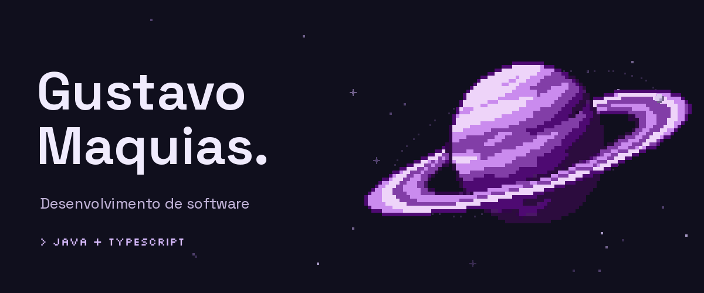
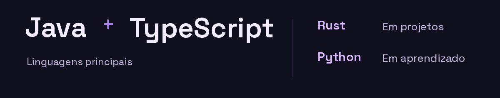
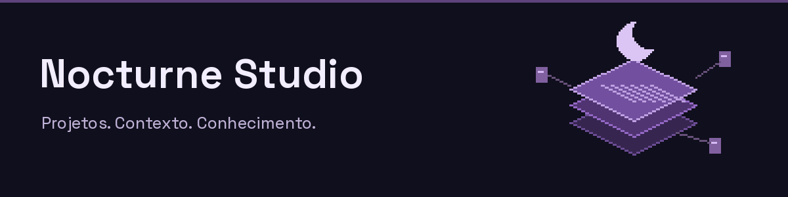
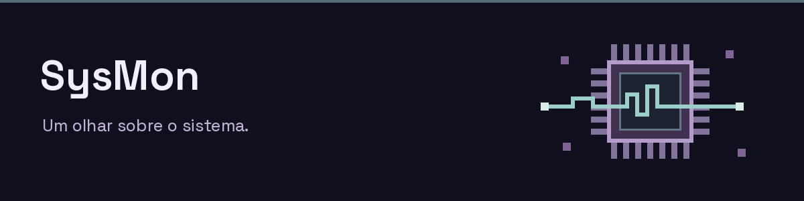

<h1>
  <picture>
    <source media="(prefers-reduced-motion: reduce) and (max-width: 760px)" srcset="./assets/hero-mobile.png">
    <source media="(prefers-reduced-motion: reduce)" srcset="./assets/hero.png">
    <source media="(max-width: 760px)" srcset="./assets/hero-mobile.gif">
    
  </picture>
</h1>

  Crio aplicações desktop e ferramentas para entender sistemas. 
  Estudante de Análise e Desenvolvimento de Sistemas na UniFil.

  <a href="#projetos">Projetos</a> &nbsp;·&nbsp;
  <a href="https://portfoliogustavomfg.vercel.app/">Portfólio</a> &nbsp;·&nbsp;
  <a href="#vamos-conversar">Contato</a>

<picture>
  <source media="(max-width: 760px)" srcset="./assets/languages-mobile.png">
  
</picture>

**Aplicações** &nbsp; Electron · React · Node.js · HTML/CSS · APIs REST 
**Dados** &nbsp; SQL · SQLite 
**Ambiente** &nbsp; Linux · Git · GitHub

## Projetos

<h3>
  <a href="https://github.com/gustavomfg/nocturne-studio">
    <picture>
      <source media="(max-width: 760px)" srcset="./assets/nocturne-mobile.png">
      
    </picture>
  </a>
</h3>

Um workspace desktop **local-first** para engenharia de software assistida por IA. Projetos, documentação e conhecimento persistente reunidos no mesmo lugar.

A interface se comunica com os recursos nativos por **IPC tipado**. Sistemas de contexto e revisão ajudam a analisar software e produzir recomendações técnicas sob aprovação do desenvolvedor.

**Electron · React · TypeScript · SQLite · IPC** 
[Explorar Nocturne Studio →](https://github.com/gustavomfg/nocturne-studio)

<h3>
  <a href="https://github.com/gustavomfg/sysmon">
    <picture>
      <source media="(max-width: 760px)" srcset="./assets/sysmon-mobile.png">
      
    </picture>
  </a>
</h3>

Um monitor de sistemas para **Linux**, feito em Rust. Telemetria em tempo real de CPU, memória, GPU, rede, armazenamento, temperaturas e processos, direto no terminal.

Coleta, interpretação e visualização separadas, com histórico de métricas e inventário dinâmico de hardware. A leitura de GPU NVIDIA usa `nvidia-smi`, quando disponível.

**Rust · Ratatui · Crossterm · Linux** 
[Explorar SysMon →](https://github.com/gustavomfg/sysmon)

## Agora

**Aprendendo Python**, com aplicação no [Nocturne Inspector](https://github.com/gustavomfg/nocturne-inspector), e cursando **Análise e Desenvolvimento de Sistemas na UniFil**, com conclusão prevista para março de 2028.

Busco uma oportunidade de **estágio ou desenvolvimento júnior**. Português nativo e inglês intermediário.

## Vamos conversar

[LinkedIn](https://www.linkedin.com/in/gustavomfg/) &nbsp;·&nbsp; [Portfólio](https://portfoliogustavomfg.vercel.app/) &nbsp;·&nbsp; [E-mail](mailto:gustavomfgdev@gmail.com)
